# 0. Introducing C++

[Hengfeng Wei (魏恒峰)](https://hengxin.github.io/)\\
hfwei@nju.edu.cn

Sep. 19, 2024

---
class: no-page two-media
---

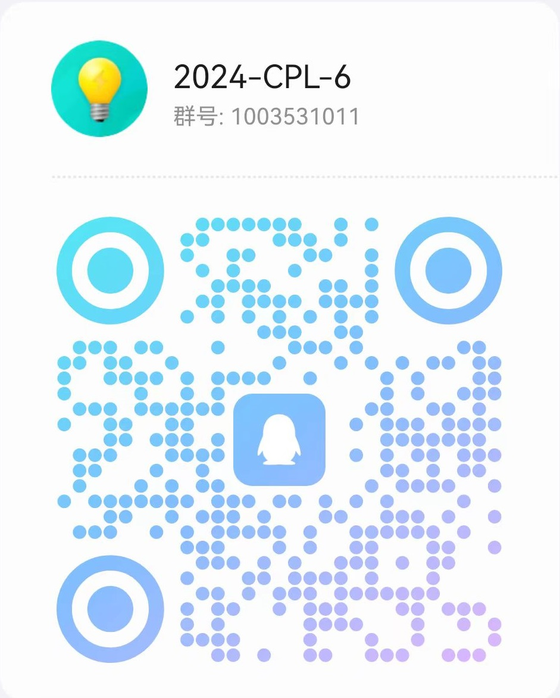 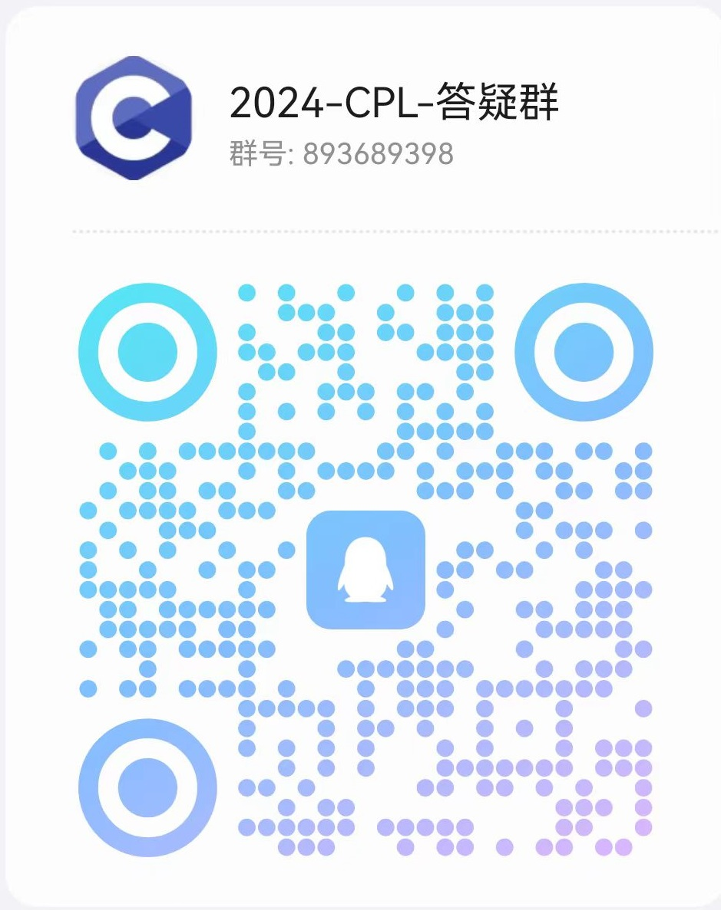

---
class: image-slide
---

# Questionnaire (1)

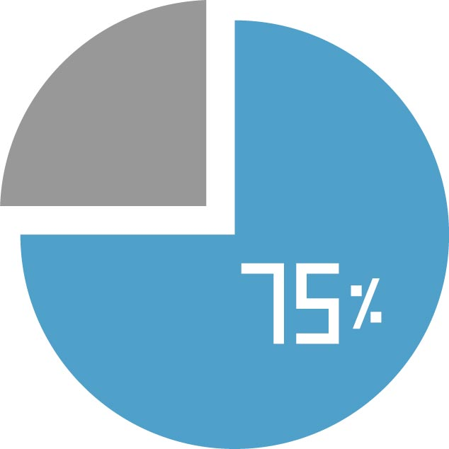

**75%** of students are new to programming.

---
class: image-slide
---

# Questionnaire (2)

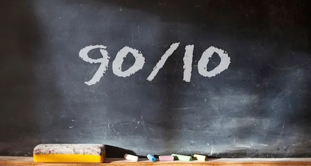

**10%** of students attended in some programming contests.

---
class: image-slide
---

# Questionnaire (3)

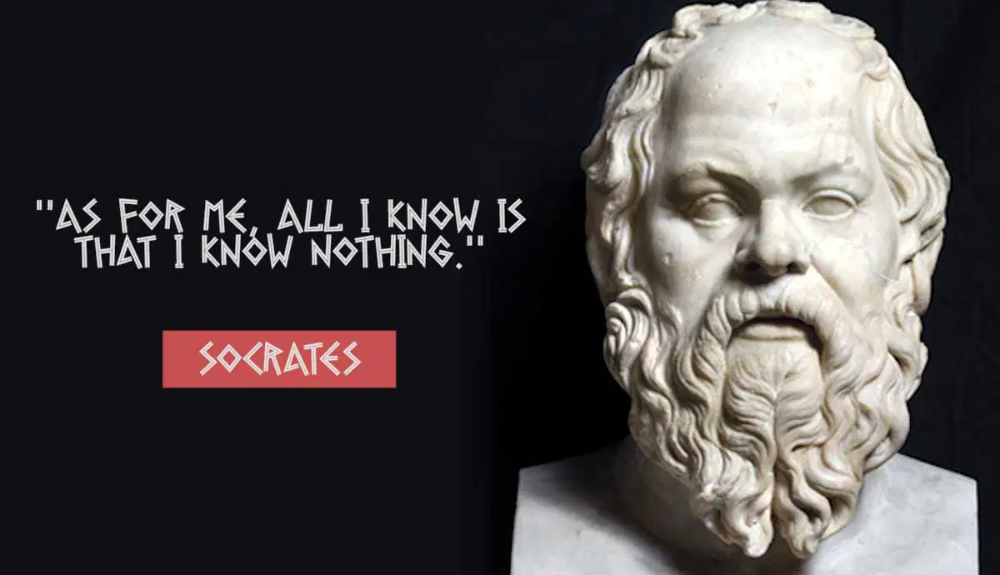

### **The C++ Beginners (know 0%)**

---
class: image-slide
---

# The C++ Beginners

---
class: image-slide
---

# To The C++ Beginners

---
layout: center
class: text-center journey-slide
---

# From Beginners to Masters

## Programming

## De-Programming

---
class: image-slide compact-image
---

## [cpl-docs @ docs.cpl.icu](http://docs.cpl.icu)

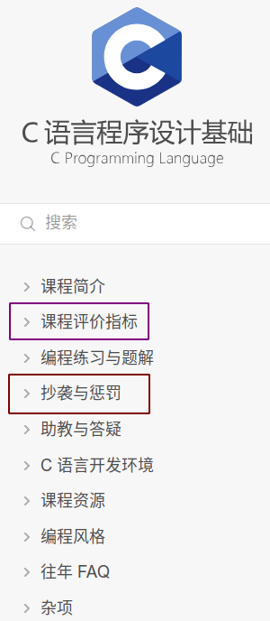

---
class: image-slide compact-image
---

## [CPL Docs @ FeiShu](https://ymv59wdgrr.feishu.cn/wiki/A1HzwviAgiFnQwkfRUWcVjqunLf?from=from_copylink)

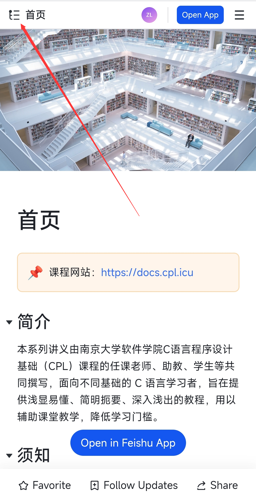

---
class: two-media resource-slide
---

## [oj @ oj.cpl.icu; oj @ public.oj.cpl.icu](https://public.oj.cpl.icu/)

 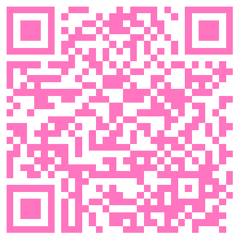

---
class: two-media resource-slide
---

# [2024cpl @ Zulip](https://2024cpl.zulipchat.com/join/t4kpy6uj6ximq7k3qwve5smj/)

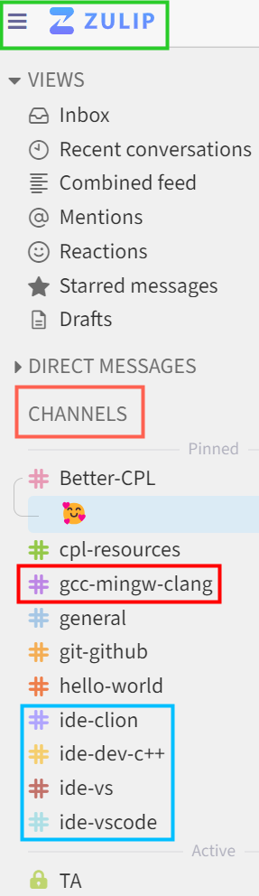 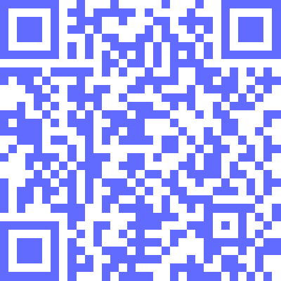

---
class: scores-slide
---

# Scores

- ~~考勤 (非必要不点名)~~
- 平时编程练习 (10 分)
- 阶段机试 1 (15 分)
- 阶段机试 2 (20 分)
- 期末机试 (30 分)
- 期末项目 (25 分)

---
class: image-slide warning-slide
---

# No Plagiarism!!!

**编程练习**：每次扣 5 分，10 分扣完为止；**期末项目**：项目分数清零

---
class: image-slide
---

### **About the 2024CPL Class**

---
class: no-page two-media
---

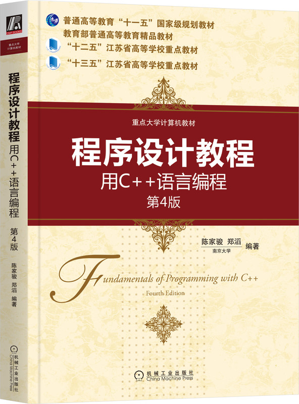 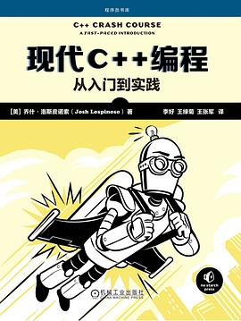

---
layout: center
class: no-page book-slide
---

---
class: no-page two-media
---

 

---
class: image-slide three-media
---

# C++ Foundations

  

---
class: image-slide large-image history-slide
---

### [C++ and Its C Roots @ cppreference](https://en.cppreference.com/w/cpp/language/history) **[[C++17](https://en.cppreference.com/w/cpp/17); [C++23](https://en.cppreference.com/w/cpp/23)]**

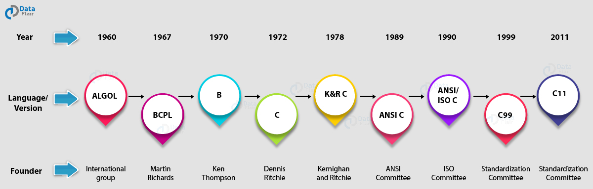

You do *not* need to be a **language lawyer**!

---
class: no-page two-media
---

 

---
class: image-slide
---

### **More Books in the Class …**

---
layout: center
class: no-page book-slide
---

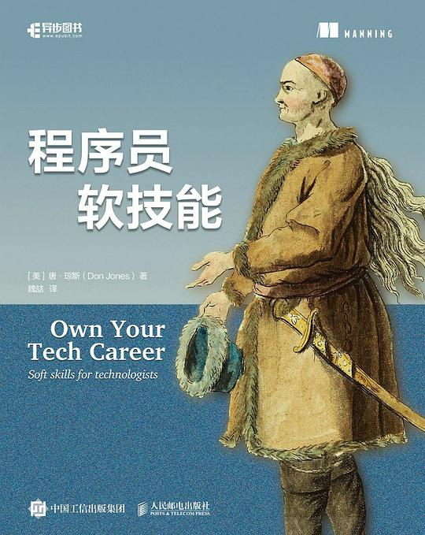

---
layout: center
class: no-page book-slide
---

---
layout: center
class: no-page book-slide
---

---
layout: center
class: no-page book-slide
---

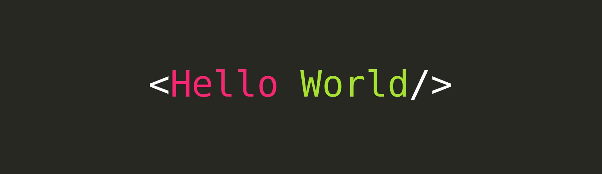

---
layout: center
class: no-page book-slide
---

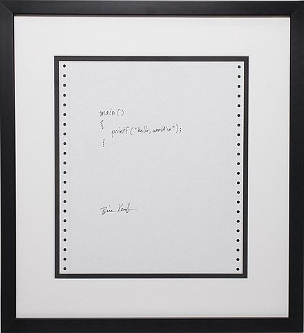

---
class: image-slide
---

# [Game: Guess the Number](https://www.abcya.com/games/guess_the_number)

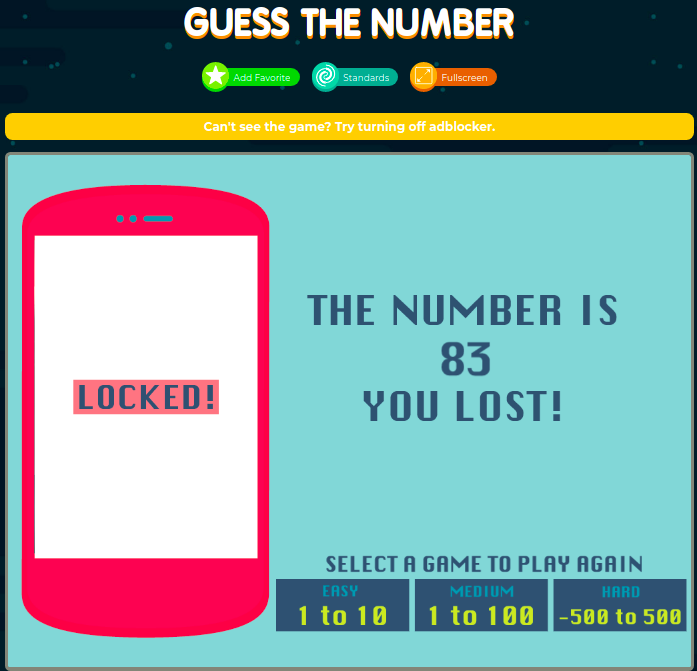

---
layout: center
class: text-center quote-slide
---

# [Game: Guess the Number](https://www.abcya.com/games/guess_the_number)

Programming is *not* (only) about languages.

You learn C++ to express **your ideas** with **computers**.

---
class: image-slide large-image
---

# [C++ reference](https://en.cppreference.com/w/cpp)

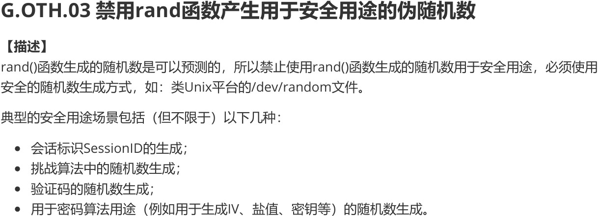

---
layout: center
class: text-center equation-slide
---

# [Game: Guess the Number](https://www.abcya.com/games/guess_the_number)

**Program** = *Input* + *Data* + *Operations* + *Output*

---
class: two-media secure-slide
---

# Secure Coding in C++

 

---
class: image-slide
---

---
class: image-slide large-image
---

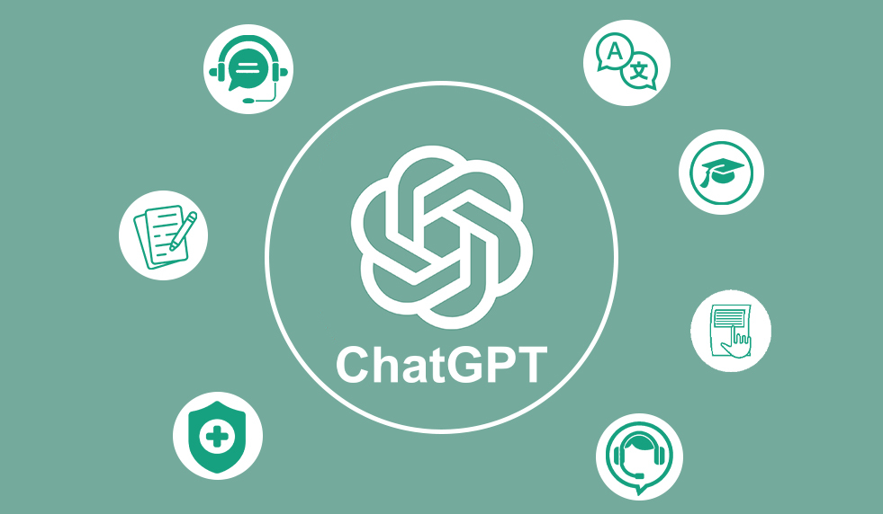

---
layout: center
class: image-slide no-page closing
---

