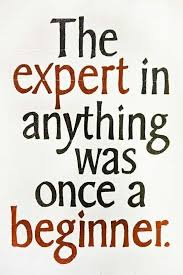
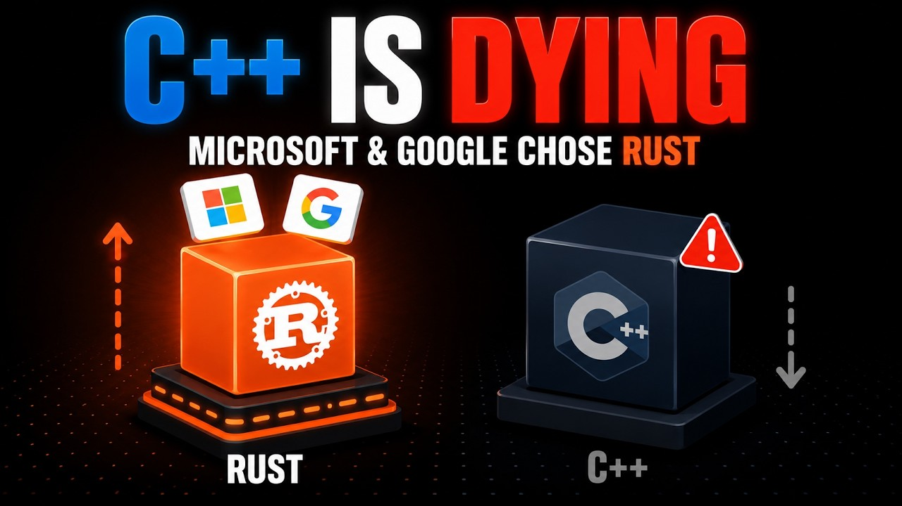
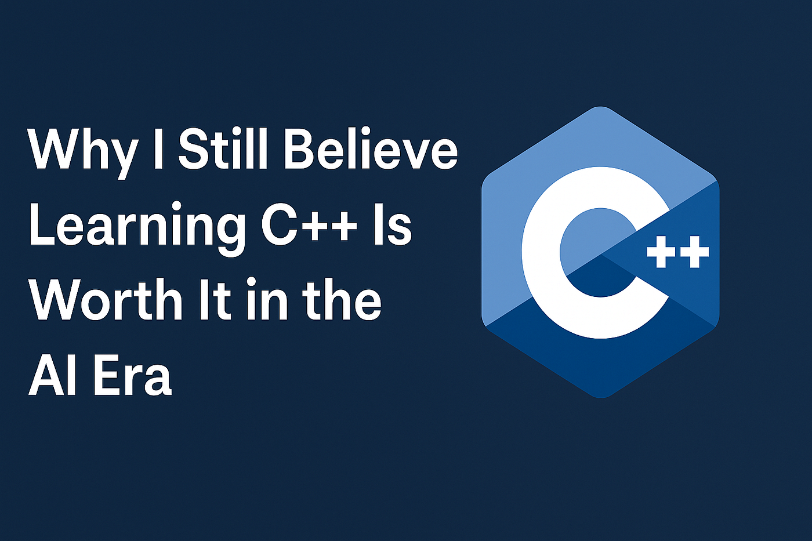
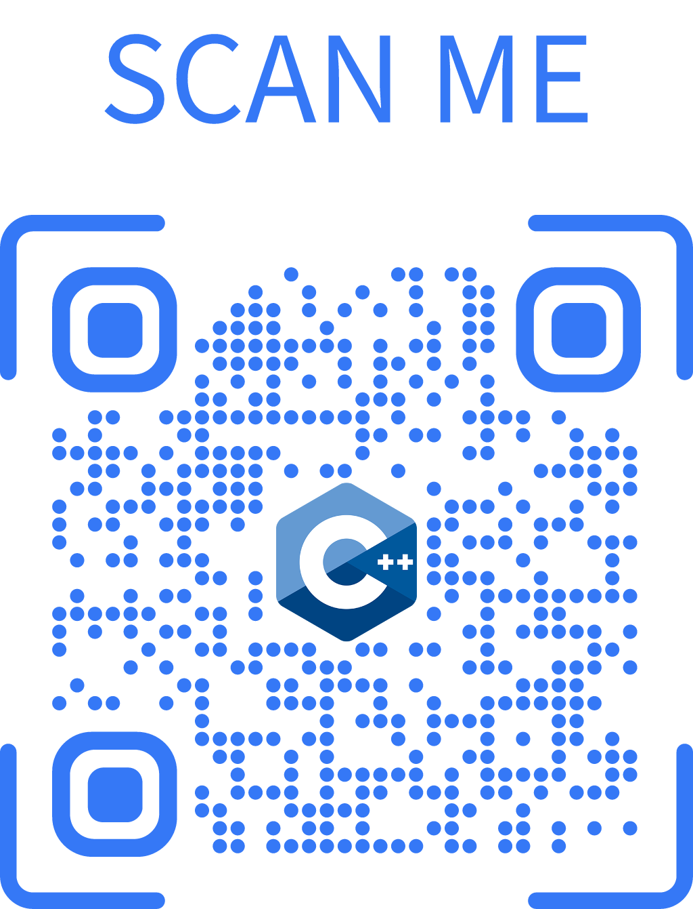
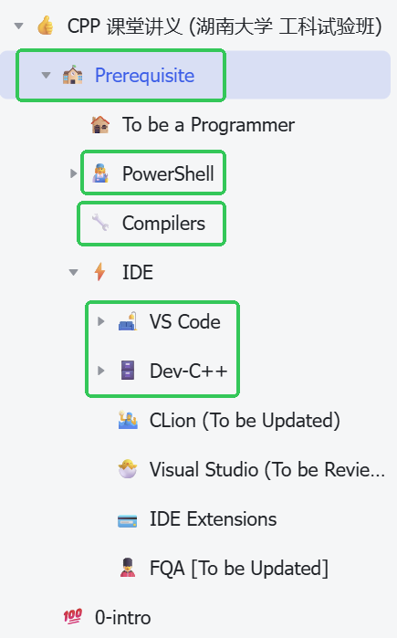
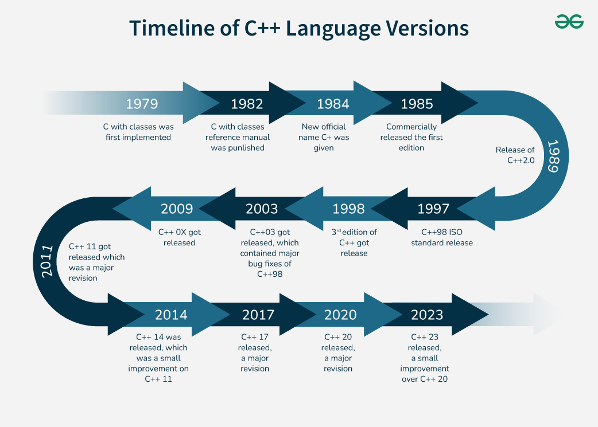

# 
0. &nbsp; Introducing C++

[Hengfeng Wei (魏恒峰)](https://hengxin.github.io/)
hfwei@hnu.edu.cn

Sep. 14, 2026

---

---
# Questionnaire (1)

#### <mark>$??\%$ of students attended in some programming contests.</mark>

---
# Questionnaire (2)

### <mark>The C++ Beginners (know $0\%$)</mark>

---
# The C++ Beginners

---
# To The C++ Beginners

 

---

<!-- ---
## [oj @ oj.cpl.icu; oj @ public.oj.cpl.icu](https://public.oj.cpl.icu/)

  -->

---

---
# Scores

* ~~考勤~~

* 平时编程练习 ($20$ 分)
* 阶段测试 ($20$ 分)
  - 第 $7, 11, 13, 17$ 周
* 期中机试 ($15$ 分)
  * 期末替代: 折扣 $15 * 80\%$
* 期末机试 ($45$ 分)

期末项目 (可选; 不计分)

---
#

---
# "出来混, 总是要还的"

---

## <mark>About the CPP2026 Class</mark>

---

## <mark>以《CPP 课堂讲义》为主</mark>

---

---

---

---

# <mark>PPP3</mark>

---

---

---

# <mark>C++ 11</mark>

---
### [History of C++ @ cppreference](https://en.cppreference.com/cpp/language/history) **[[C++11](https://en.cppreference.com/cpp/11); [C++20](https://en.cppreference.com/cpp/20)]**

You do *NOT* need to be a **language lawyer**!

---

# <mark> Some Books are $\ldots$</mark>

 

---

### <mark>More Books during the Class $\ldots$</mark>

<!-- ---

 -->

---

---

---

---
# [Game: Guess the Number](https://www.abcya.com/games/guess_the_number)

---
# [Game: Guess the Number](https://www.abcya.com/games/guess_the_number)

 

 

Programming is *NOT* (only) about languages.

 

You learn C++ to express <mark>**YOUR IDEAS**</mark> with **COMPUTERS**.

---
# [Game: Guess the Number](https://www.abcya.com/games/guess_the_number)

 

 

 

**Program = Input + Data  + Operations + Output**

---

---

