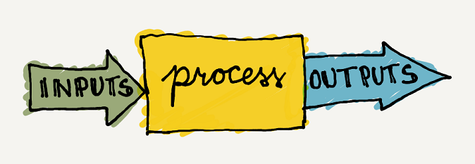
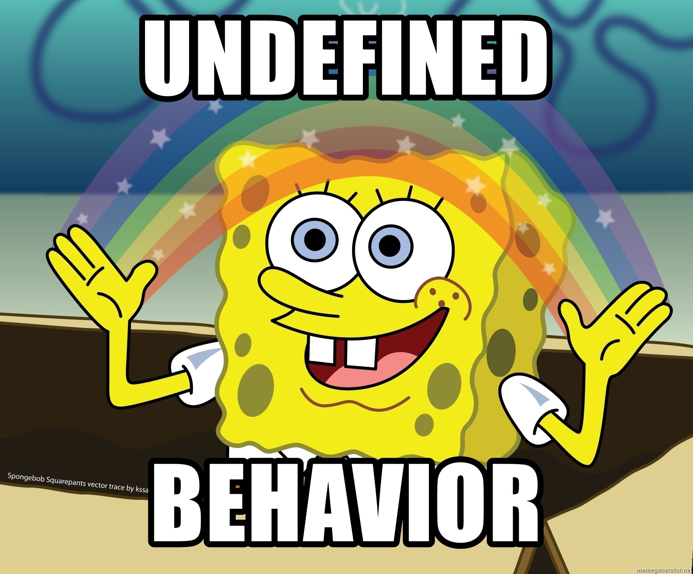
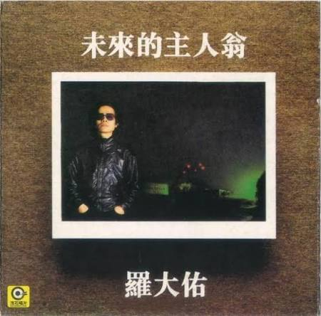
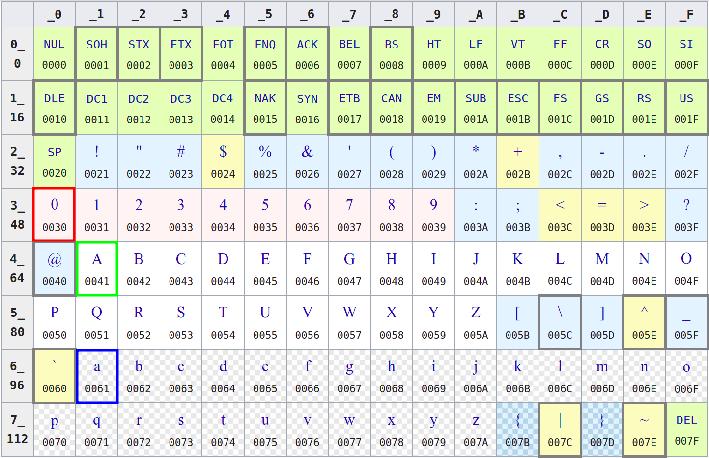

# 
1. &nbsp; Variables, Types, I/O

[Hengfeng Wei (魏恒峰)](https://hengxin.github.io/)
hfwei@hnu.edu.cn

Sep. 16, 2026

---
# Overview

**Program = Input + Data  + Operations + Output**

---
# Overview

### Variables (变量) &emsp; Data Types (数据类型)

 

### Operators (运算符) &emsp; Expressions (表达式)
### Assignment Statements (赋值语句)

 

### I/O (Input/Output; 输入输出)

---

## <mark>circle.c &ensp; sphere.c</mark>
## <mark>admin.c &ensp; admin-cin.c</mark>

---
# Circle

Given a **radius** (say $10$) of a circle,
to compute its **circumference** and **area**.

 

$L = 2\pi r$ &emsp; $S = \pi r^2$

 

- 每个结果各占一行
- 小数点后保留两位

---
# Declaration/Definition (声明/定义)
<code>int radius{10};</code>

 

* <mark>Declare/Define</mark> a *variable* called `radius`.
* `radius` refers to a <mark>location</mark> in memory.
* The <mark>type</mark> of `radius` is `int` (integer).
* `radius` is <mark>initialized</mark> to $10$.
* You can <mark>assign</mark> other integers to `radius`.

---
# Identifiers (标识符)

<code>int radius{10};</code>

 

`radius` is an *identifier*.

**Warning:** Do *not* start with <code>_</code>, which are reserved by C++.

 

#### Always use <mark>meaningful</mark> identifiers in a <mark>uniform</mark> style!!!

---
<code>int radius;</code>

<code>cout << radius;</code>

 

#### [Undefined Behavior (UB)](https://pvs-studio.com/en/blog/posts/cpp/1129/)

---
# Operators \& Expressions

 
 
 

<code>double circumference{2 * PI * radius};</code>

---
# Sphere

Given a <mark>radius</mark> (say $100$) of a sphere,
to compute its <mark>surface area</mark> and <mark>volume</mark>.

$A = 4 \pi r^2\quad V = \frac{4}{3} \pi r^3$

- 每个结果占 $1$ 行
- 小数点后保留 $4$ 位
- 每个结果至少占 $15$ 字符, 左对齐
  - `_______________ : surface_area`
  - `_______________ : volume`

<!-- ---
# mol
$6$ 克氧气的分子数是多少?

 

$Q = 6 / 32 \times 6.02 \times 10^{23}$

 

使用<mark>科学计数法</mark>表示, 保留 <mark>$5$ 位有效数字</mark> -->

---
# Input/output manipulators (操纵符)

<code>#include \<iomanip\></code>
 
 

# <!--fit--> [https://en.cppreference.com/cpp/io/manip](https://en.cppreference.com/cpp/io/manip)

---

# <code>std::format</code>

 
 

# <!--fit--> [https://en.cppreference.com/cpp/utility/format/spec](https://en.cppreference.com/cpp/utility/format/spec)

---
### <mark>Format Specification</mark>
# <!--fit--> <code>{:[align][width][.precision][type]}</code>

- <code>%d</code>: decimal `int`
- <code>%f</code>: `double`
- <code>%s</code>: `string` (not necessarily)
- <code>%c</code>: `char` (not necessarily)

---
# <!--fit--> <code>{:[align][width][.precision][type]}</code>

 
 

- $<$: left-justified
- $>$: right-justified
- $\hat{}$: centered

---
# <!--fit--> <code>{:[align][width][.precision][type]}</code>

 
 

- minimum field width
- padded with spaces if it has fewer characters

---
# <!--fit--> <code>{:[align][width][.precision][type]}</code>

 
 

* `%f`: <mark>number</mark> of digits after `.`
* `%s`: <mark>maximum number</mark> of characters

---
# A (Naive) Administration System

 
 

- Name (EN)

- Gender (F/M)

- Birthday (mm-dd-yyyy)

- Weekday (Xyz.)

 

- C++
- Music
- Medicine
 
- Mean (.d)
- Standard Deviation (.dd)
- Ranking ($\%$)

---

 

### For 罗大佑 only:
 

- 每组信息占一行
- 各项信息使用 `\t` 间隔
- 各项信息遵循特定格式要求

---
# <code>char</code>

A `char` is actually an `int`.

---
# C++ String

 
 

<code>std::string first_name{"Tayu"};</code>

---

# [未来的主人翁](https://www.bilibili.com/video/BV1324y1f7jV/)

---
# Review

**Program = Input + Data  + Operations + Output**

