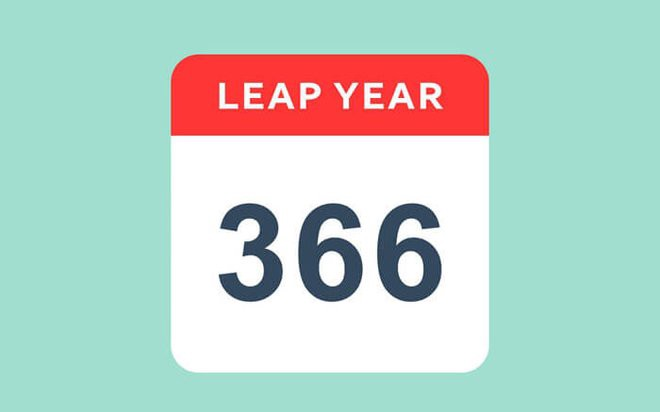
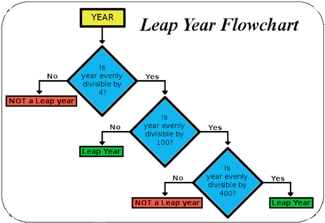
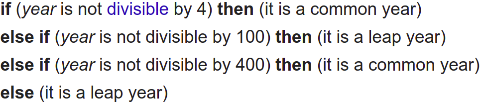
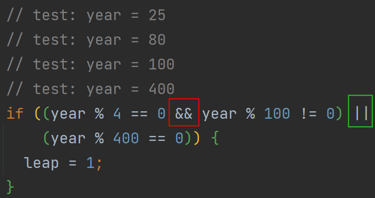

# 
2. &nbsp; If $\ldots$

 

[Hengfeng Wei (魏恒峰)](https://hengxin.github.io/)
hfwei@hnu.edu.cn

Sep. 20, 2024

---
# Review

### Variables (变量) &emsp; Data Types (数据类型)

 

### Operators (运算符) &emsp; Expressions (表达式)
### Assignment Statements (赋值语句)

 

### I/O (Input/Output; 输入输出)

---
# Overview
 
 

# If Statement (`if` 语句)
# Switch Statement (`switch` 语句)

 
 

---

## <mark>min.cpp &ensp; adult.cpp &ensp; leap.cpp &ensp; next-day.cpp</mark>

---
# Min of Two
 
 

#### Given two integers $a$ and $b$, to compute their minimum.
 

$min = \min\{a, b\}$

---
 
 

## <code>min = a >= b ? b : a;</code>
#### (三目运算符)
 

## Do Not Use it Too Much!

<!-- ---
# Min of Two
 

Given two doubles $a$ and $b$, to compute their minimum.
 

$\mathit{min} = \min\{a, b\}$ -->

---
# Min of Three
 
 

#### Given three integers $a$, $b$, and $c$, to compute their minimum.
 

$\mathit{min} = \min\{a, b, c\}$

---

# If with Initializer (C++17)

 

## Input age; check if adult ($\geq 18$).

 

## <mark>adult-outside.cpp &ensp; adult-inside.cpp
## <mark>adult-if-init.cpp</mark>

---

# Variable Scope: Three Ways

| 写法 | 作用域 | 泄漏? | 重复代码? |
|------|--------|:-----:|:---------:|
| 外部声明 | 整个函数 | 是 | 否 |
| 分支内声明 | 单个分支 | 否 | 是 |
| <mark>if 初始化器</mark> | 整个 if-else | <mark>否</mark> | <mark>否</mark> |

 

### <mark>Keep scopes small (CG ES.5)</mark>

---
# Leap Year

---
# Leap Year (1): Nested `if/else` (YES)

---

# <code>==</code> vs. <code>=</code>

 

<code>if (year == 0) { ... }</code>

 

<code>if (year = 0) { ... }  // ALWAYS FALSE!</code>

---
# Leap Year (2): Nested `if/else` (NO)

---
# Leap Year (3): `else if`
 

---
# Leap Year (4): The Ultimate Version
 

## A year is a <mark>**leap year**</mark> if
 

- it is divisible by $4$ but not by $100$,
- except that years divisible by $400$ are leap years.

---
# Short-circuit Evaluation (短路求值)

---

# Order of Evaluation

 
 

## For most operators (except `&&`, `||`, `?:`), operand evaluation order is <mark>unspecified</mark>.

---

<code>int x{i + i++};  </code>

 

---

# <code>[[likely]]</code> / <code>[[unlikely]]</code> (C++20)

 
 
 

### (Only) a hint to compiler for branch prediction

---

# Next Day Calculator

 

## Given (year, month, day), print the next day.

 

### `2024-2-28 → 2024-2-29`

### `2024-12-31 → 2025-1-1`

---

 

### <mark>days-of-month.cpp &ensp; temperature-control.cpp </mark>

---

# Fall-through & Case Scope

 
 

* Missing `break` = implicit fall-through (usually a bug)
* Intentional fall-through: use `[[fallthrough]]`
* Variables in `case`: use <mark>`{}`</mark> to limit scope

---

# switch with Initializer (C++17)

 
 

## Temperature Control

---

# if-else vs. switch

 
 

### Prefer `switch` for discrete constants (CGL ES.70)

---
