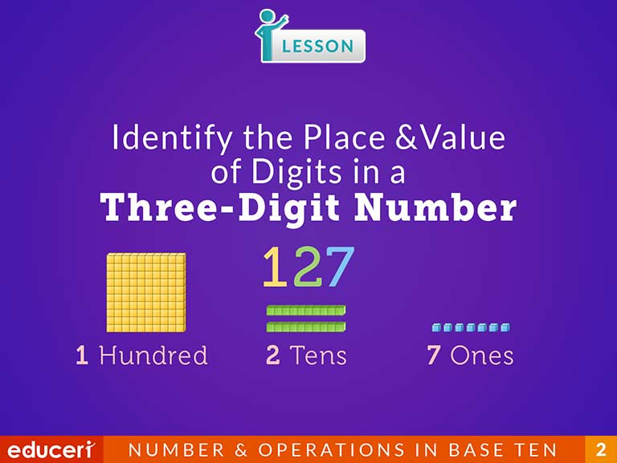
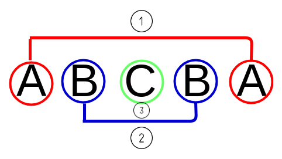
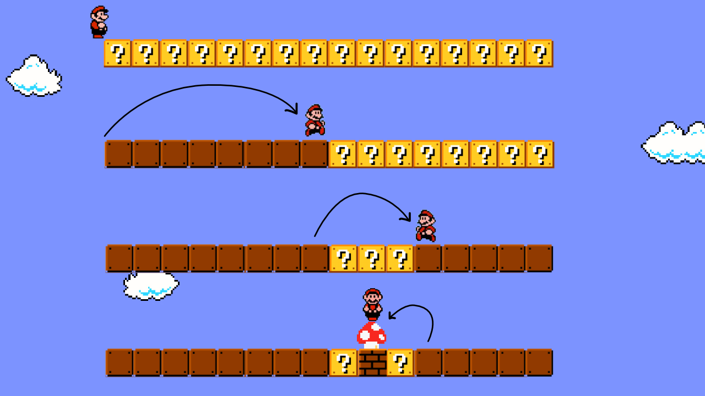

# 
3. &nbsp; While $\ldots$

[Hengfeng Wei (魏恒峰)](https://hengxin.github.io/)
hfwei@hnu.edu.cn

Sep. 24, 2026

---
# Review
 

### If Statement
### Switch Statement

 

### Logical Expressions

 

---
# Overview
 

### While (Do-While) Statement
 

### `break` Statement

---

while syntax

---

loop invariant

---

## <mark>euclid.cpp &ensp; fib.cpp &ensp; digits.cpp &ensp; palindrome.cpp &ensp; binary-search.cpp</mark>

---

# Greatest Common Divisor

$\text{gcd}(a, b) = \text{gcd}(b, a \;\%\; b)$

---

loop invariant for euclid

---

# Fibonacci Sequence
 

$F_{0} = 0$

$F_{1} = 1$

$F_{n} = F_{n-1} + F_{n-2} \quad (n > 1)$

---

loop invariant for fib

---
# Number of Digits

---
# Palindrome

---
# Binary Search

---
# Array Initializer
 

* <code>int numbers[NUM] = {1};</code>
 

* <code>int numbers[] = {0, 1, 2};</code>
 

* <code>int numbers[NUM] = {[1] = 1};</code>

---
# Array Initializer (DON'T)
 

<code>int numbers[NUM] = {};</code>
 

## Forbidden in C99 (Unfortunately!)
## Allowed by GCC by default (Unfortunately!!)
## Allowed in C23 (Fortunately or not???)

---
# Array Initializer (DON'T)
 

<code>int numbers[NUM];</code>
 

## `numbers` may contain garbage values;
## always initialize it

---
# Array Initializer (DON'T)
 

<code>int numbers[];</code>
 

## You <mark>must</mark> specify the size so that the compiler/runtime can allocate memory for it.

---
