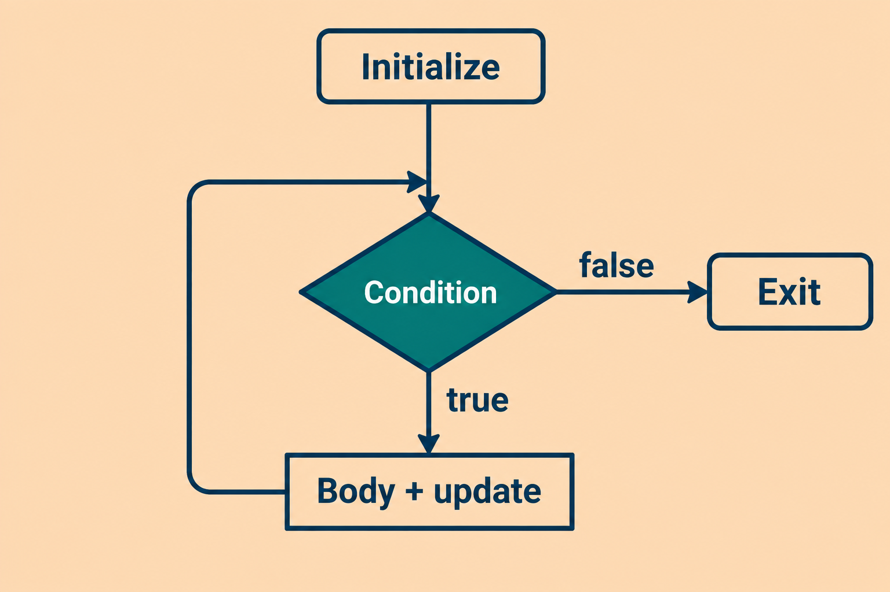
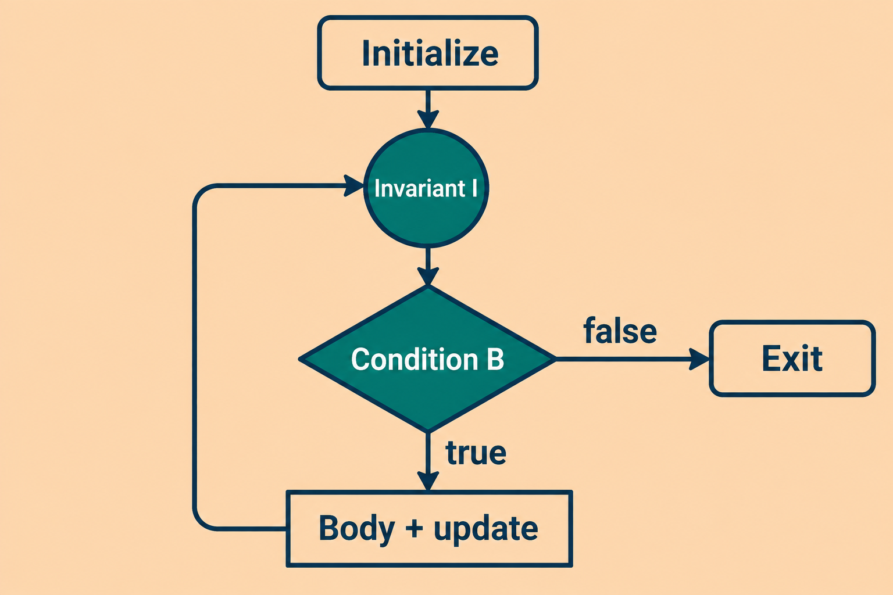

# <p id = "small-caps">3. &nbsp; While $\ldots$</p>

<br>

[Hengfeng Wei (魏恒峰)](https://hengxin.github.io/)
hfwei@hnu.edu.cn


Sep. 24, 2026

---
# Review
<br>

<font color = red>

### If Statement
### Switch Statement

<br>

### Logical Expressions
</font>
<br>

---
# Overview
<br>

<font color = red>

### While (Do-While) Statement
<br>

### `break` Statement
</font>

---

# `while` Statement



```cpp
// initialize
while (condition) {
  // body + update
}
```

May execute **zero** times.

---
# Loop Invariant as Abstraction

#### <mark>What remains true before every iteration?</mark>



---


## <mark>euclid.cpp &ensp; fib.cpp &ensp; digits.cpp &ensp; palindrome.cpp &ensp; binary-search.cpp</mark>

---

# Greatest Common Divisor

$\text{gcd}(a, b) = \text{gcd}(b, a \;\%\; b)$


$$
(48,18)\;\longrightarrow\;(18,12)\;\longrightarrow\;(12,6)\;\longrightarrow\;(6,0)
$$

---

# Loop Invariant

<br>

#### $a_0,b_0>0$: original inputs

<br>

$$
\boxed{\gcd(a,b)=\gcd(a_0,b_0)}
$$

<br>

$$
(a,b)\;\xrightarrow{\;b\ne0\;}\;(b,\;a \;\%\; b)
$$

---

# Fibonacci Sequence
<br>

$F_{0} = 0$

$F_{1} = 1$

$F_{n} = F_{n-1} + F_{n-2} \quad (n > 1)$

---

# Loop Invariant

<br>

$i: \texttt{index}$, $\quad 0\le i\le n$

<br>

$$
\boxed{\texttt{previous}=F_i \qquad \texttt{current}=F_{i+1}}
$$

<br>

$$
\underbrace{(F_i,\;F_{i+1})}_{\text{before}}\;\longrightarrow\;
\underbrace{(F_{i+1},\;F_i+F_{i+1})}_{\text{after: }(F_{i+1},\;F_{i+2})}
$$

---
# Number of Digits


---
# Palindrome


---
# Binary Search


---
# Array Initializer (DO)
<br>

* <code style="background: transparent"><font color = "#17324D" size = 8>int numbers[4] = {1};</font></code>
  First element is `1`; the rest are `0`.
<br>

* <code style="background: transparent"><font color = "#17324D" size = 8>int numbers[] = {0, 1, 2};</font></code>
  Size is deduced: `3`.

<br>

* <code style="background: transparent"><font color = "#17324D" size = 8>int numbers[4] = {};</font></code>
All elements are initialized to `0`.

---
# Array Initializer (DON'T)
<br>

<code style="background: transparent"><font color = "#17324D" size = 8>int numbers[4];</font></code>
<br>

## Initialize before reading.

---
# Array Initializer (DON'T)
<br>

<code style="background: transparent"><font color = "#17324D" size = 8>int numbers[];</font></code>
<br>

## Specify the size, or provide initial values.
## `int numbers[] = {0, 1, 2};`

---

