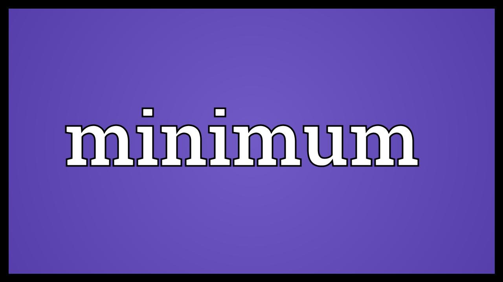
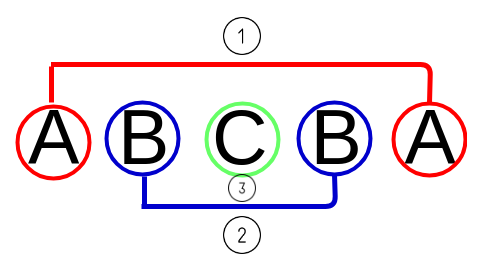
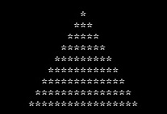
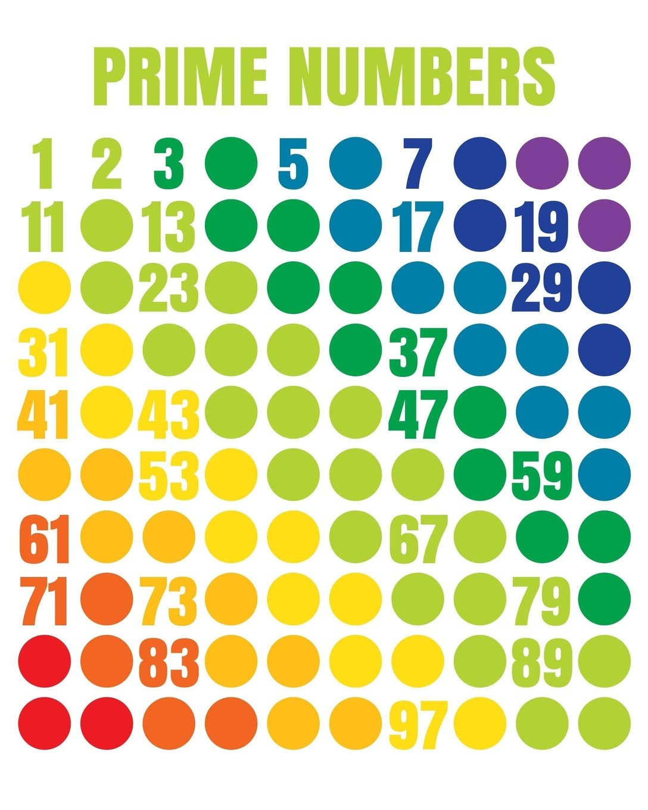
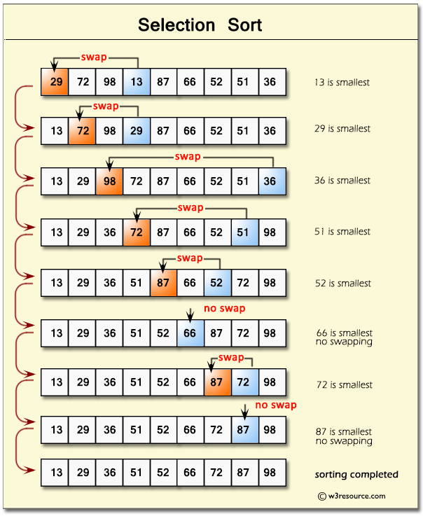

# 
4. &nbsp; For $\ldots$

[Hengfeng Wei (魏恒峰)](https://hengxin.github.io/)
hfwei@hnu.edu.cn

Sep. 28, 2026

---
# Review
 

## `while` Statement
## `break` Statement

 

## [ ]; std::array
## std::vector

---
# Overview
 
 

## `for` Statement
## Nested Loops

---

## <mark>min-array.cpp &ensp; palindrome.cpp &ensp; stars.cpp</mark>
## <mark>primes.cpp &ensp; selection-sort.cpp</mark>

---
# min of an array

 

$\min(23, 56, 19, 11, 78) = \min(\min(\min(\min(23, 56), 19), 11), 78)$

 

---

# <code>for (init-clause; cond-expression; iteration-expression) loop-statement</code>

---
# Palindrome (`for` version)

---
# Stars Pyramid

---
# Prime Numbers

---
# Selection Sort

Find the minimum in `[i .. n-1]`, swap with `numbers[i]`.

---
