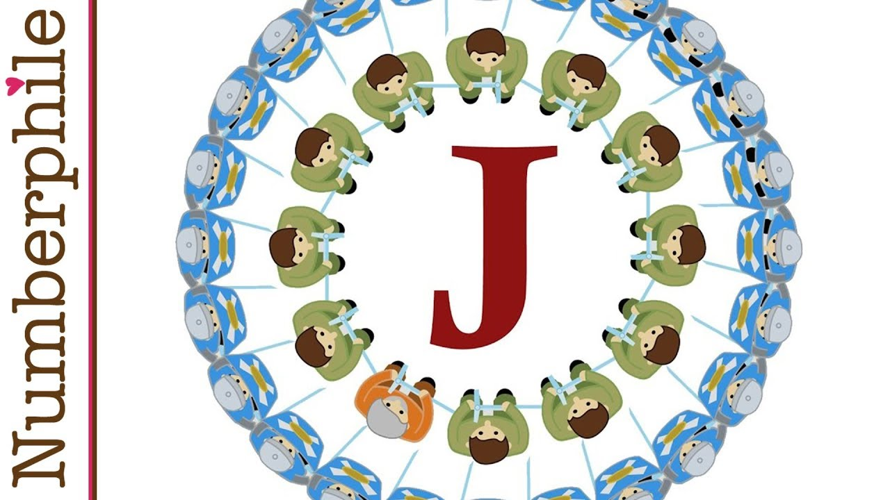
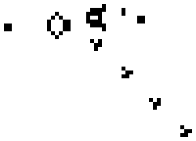
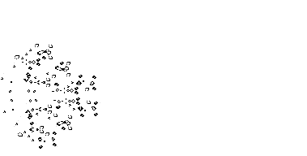
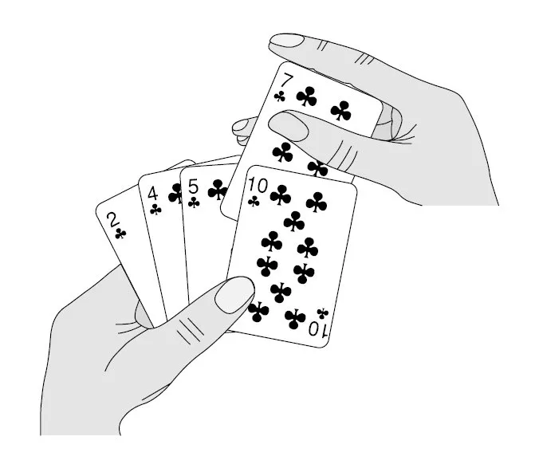
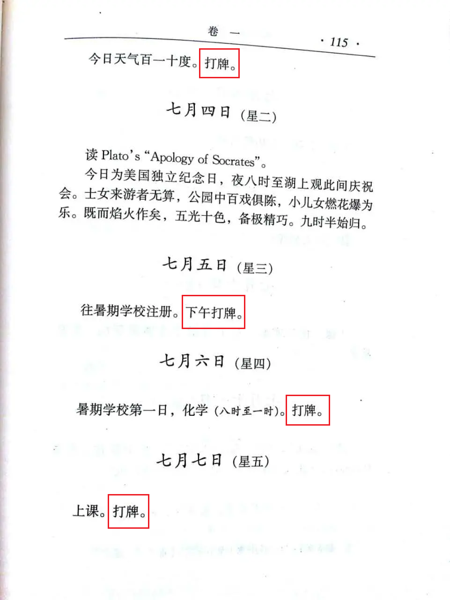
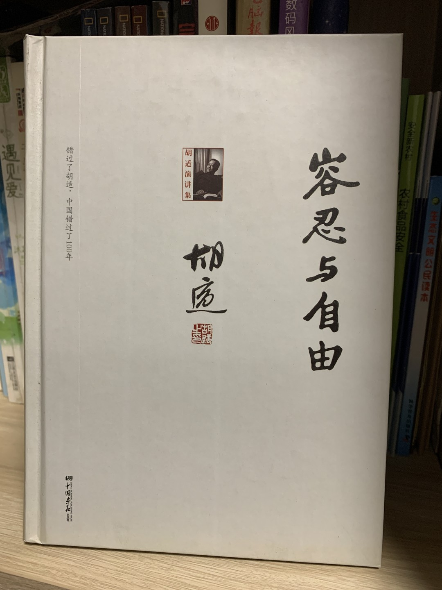
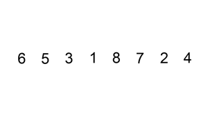
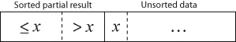
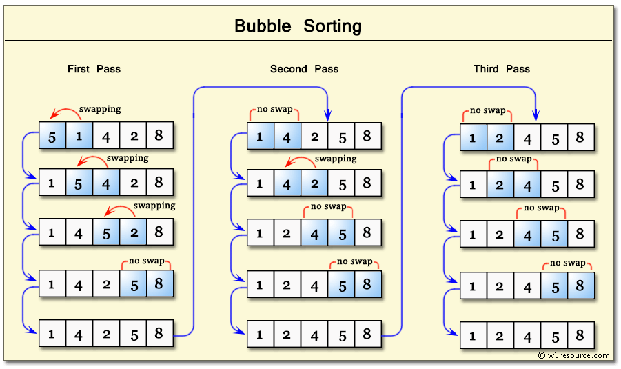

<!-- _class: lead cover -->

# 5. &nbsp; Loop

 

[Hengfeng Wei (魏恒峰)](https://hengxin.github.io/)
hfwei@hnu.edu.cn

Oct. 09, 2026

---
# Review
 
 

## `for` Statement
## Nested Loops

---
# Overview

### Loops (More Examples)
 

### vector

### Multi-dimensional Arrays (多维数组)

---

## <mark>josephus.cpp &ensp; game-of-life.cpp &ensp; insertion-sort.cpp</mark>

---

## <mark>''I hate the Josephus Game!''</mark>

---

<!--  -->

## $J(2^m + l) = 2l + 1 \quad {\small (m \ge 0 \land 0 \le l < 2^m)}$

---
# [Conway's Game of Life @ wiki](https://en.wikipedia.org/wiki/Conway%27s_Game_of_Life)

#### John Horton Conway ($1937 \sim 2020$)

---
### [playgameoflife.com (Cellular Automata; 元胞自动机)](https://playgameoflife.com/)
 
 

* Any **live** cell with two or three live neighbours survives.
* All other **live** cells die in the next generation.
 

* Any **dead** cell with three live neighbours becomes a live cell.
* All other **dead** cells stay dead.

---
 

 &ensp; 

---
<video control width = "1100"> <source src="videos/Conway-Game-of-Life.mp4" type = "video/mp4"> </video>

---
# Insertion Sort

---
 &ensp; 

---

---
 

 

---
# Bubble Sort

---

---
